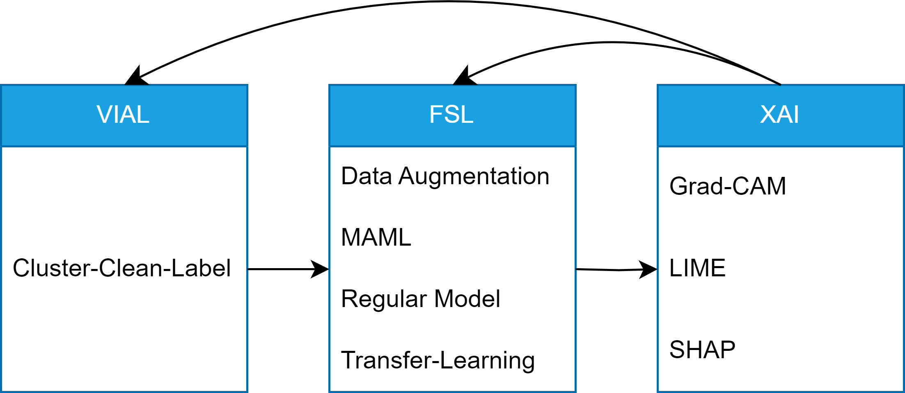

# Combining Explainable AI, Few-Shot Learning, and Visual-Interactive Labeling: A Survey and Experimental Study

This project contains the experimental prototype of the bachelor thesis "Combining Explainable AI, Few-Shot Learning, and Visual-Interactive Labeling: A Survey and Experimental Study".

## Table of Contents

- [Requirements](#requirements)
- [Usage](#usage)

## [Requirements](requirements.txt)

To run this project, the following libraries are required:

- `dash`
- `dash-bootstrap-components`
- `tensorflow`
- `tensorflow-datasets`
- `numpy`
- `matplotlib`
- `PyQt5`
- `opencv-python-headless`
- `hdbscan`
- `scikit-learn`
- `scikit-image`
- `lime`
- `shap`

## Usage

To run the Dash application, the provided `main.py` script can be used. This includes the following steps:

1. Install the required packages: `pip install -r requirements.txt`
2. Navigate to the `src` directory: `cd src`
3. Run the Dash application using the main script:

   ```bash
   python main.py

4. Open the Dash application in the browser at [http://127.0.0.1:8050/](http://127.0.0.1:8050/) 

The following figure illustrates the structure of the prototype:


